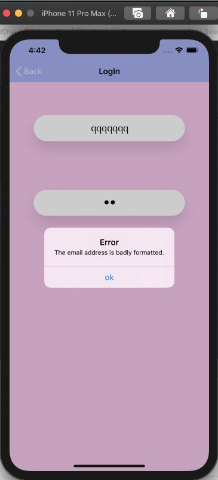
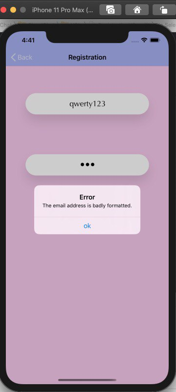
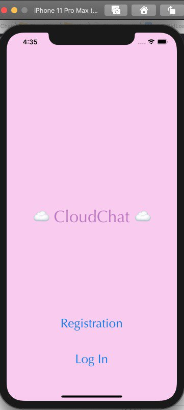
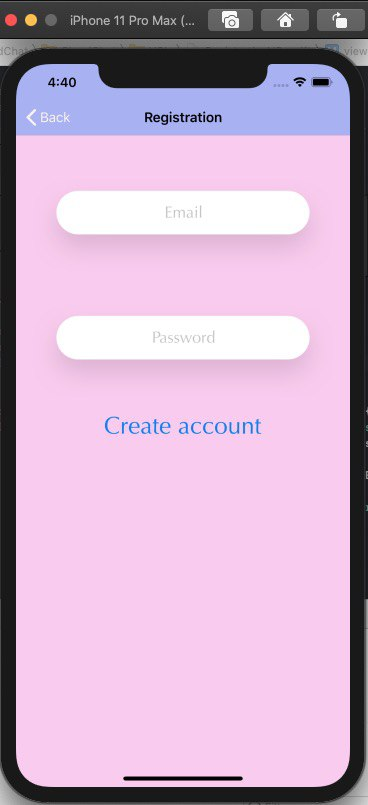
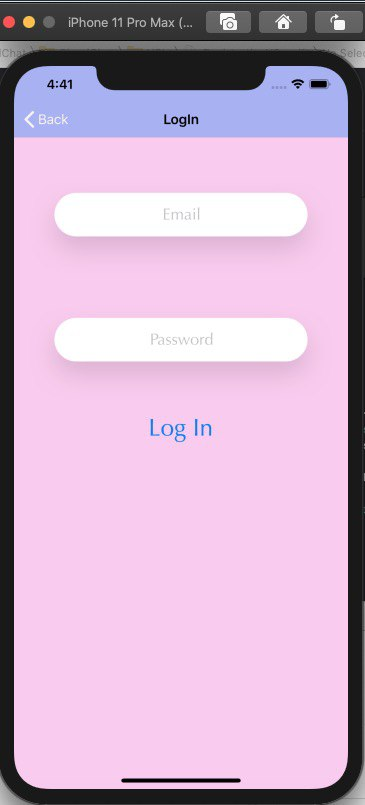
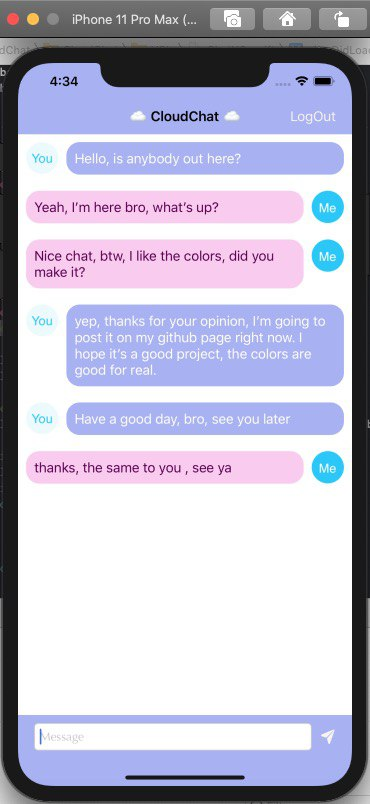

# CloudChat

This is a cute simple chat.

## Next technologies were implemented: ##

1) Perform design with storyboard and xib
2) UIStackView and Constraints for layout
3) Google Firebase framework as a container for user's messages and personal data
4) Alert and callback patterns for handling errors
5) GCD to update UI
6) Singleton pattern

## How it works: ##

If you start the app for the first time, you should register your account first, which will be created and saved on Google Firestore.

LogIn screen has the same validation algorithm.

 

If your email or password field get wrong input, you will see error alert and description. 

After you do this, app shows you chat screen, when you can read and send messages.

## About this app: ##

It consist of 4 screens:

1) Main, where I implemented animation for welcome label when the app starts.

2) Registration screen with two textField (email & password)
Use firebase to validate user and show him the localized description of error if somethings goes wrong.

3) LogIn screen, which is the same as Registration, but it has different implementation.

4) Chat screen when two people can send message to each other. 

